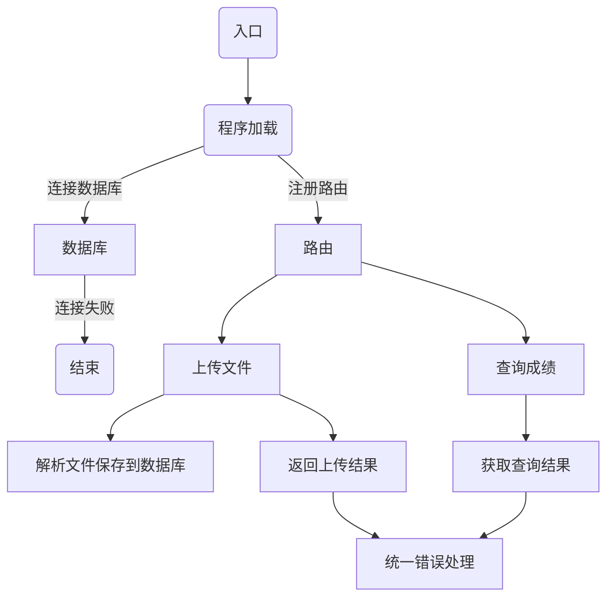

# ScoreManagement

假设我们为老师提供一个成绩统计系统，该系统支持批量多份上传成绩结果。
成绩文件为多行，每行内容为：班级、姓名、分数、科目。
上传后的成绩统计可根据不同的字段进行排序和查询某一个用户的科目分数信息。

## 启动后

1. 进入项目跟目录

2. 运行 `docker build -t score:0.0.1 .`

3. 运行 `docker run -p 8080:80 --name score -d score:0.0.1`

## 成绩文件的内容格式为

一年级二班 王铁柱 1.5 英语

一年级二班 王铁柱 13.5 语文

一年级一班 刘许芳 13.5 语文

一年级三班 张二蛋 121.5 英语

一年级三班 张二蛋 143.5 语文
